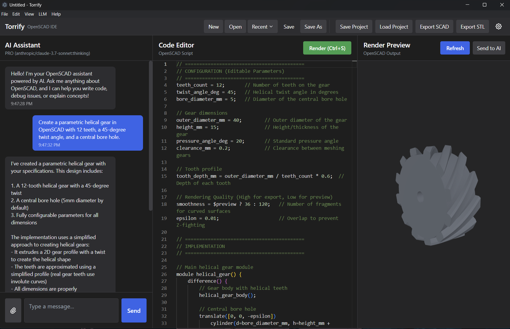

# Torrify

  

 

**An AI-assisted IDE for 3D CAD modeling** that bridges the gap between natural language and parametric design. Built with Electron, React, and TypeScript, Torrify supports OpenSCAD and build123d, allowing you to generate, edit, and visualize 3D models using simple chat commands or code.

  

  

## 🚀 Quick Start

1. **Download** the latest installer for your OS from [Releases](https://github.com/caseyhartnett/torrify/releases).
2. **Install** OpenSCAD (for OpenSCAD backend) or Python + build123d (for build123d backend).
3. **Run** Torrify and open Settings (⚙️) to configure your AI Provider (Gemini, OpenRouter, or Ollama).

For detailed instructions, see the **[Installation Guide](docs/getting-started/installation.md)**.

## 📚 Documentation

- 📖 **[User Guide & Features](docs/features/overview.md)** - Learn about AI chat, image-to-3D, and workflows.
- 🛠️ **[Developer Guide](docs/developer/README.md)** - Setup your dev environment, build, and test.
- 🏗️ **[Architecture](docs/architecture/ARCHITECTURE.md)** - Deep dive into the codebase structure.

## 🌍 Community & Showcase

Check out what's possible with Torrify!

  
   
  <strong><a href="https://makerworld.com/en/@Bigreddazer">Bigreddazer on MakerWorld</a></strong> - All models designed using this application.

**Support:** [hello@torrify.org](mailto:hello@torrify.org) — for issues, suggestions, or feedback.
**Website:** [torrify.org](https://torrify.org)

## 📄 License

Licensed under the [GNU General Public License v3.0](LICENSE).
